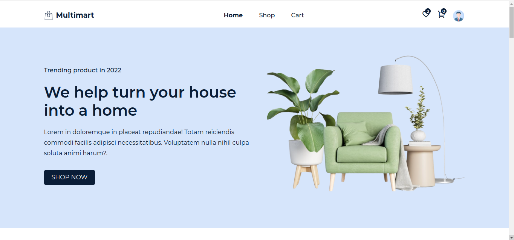

# Furniture Online Shopping

> This is an online shopping site where users can shop for variety of house or office furnitures. 



## ⚒️  Built with
- Html
- Css
- JavaScript

## 🎞️ Frameworks and Technologies used
- React && Redux
- Reactstrap
- Bootstrap
- Framer-motion

## 🖥️ Live Demo
[Demo](https://furniture-ecommerce-2022.vercel.app/):point_left:

## 🖥️ Getting Started
To get a local version up and running on your machine, follow these simple example steps.

## 🛠️ Prerequisites
```
  Install Node.js on your machine
```

## 🕹️ Setup
```
  Clone the repository on your machine and cd into it
    git@github.com:Qoosim/furniture-ecommerce.git
    cd furniture-ecommerce
  run yarn
  run yarn start
```

## 👨‍💻 Author

👤 **Qoosim AbdulGhaniyy**

- GitHub: [Qoosim](https://github.com/Qoosim)
- LinkedIn: [Qoosim](https://www.linkedin.com/in/qoosim)

## 🤝 Contributing

Contributions, issues, and feature requests are welcome!

Feel free to check the [issues page](../../issues/).

## 📦 Show your support

Give a ⭐️ if you like this project!

## 👏 Acknowledgments

- Many thanks to my Microverse mentor - Noer Paanakker for guiding all the time :bow
- Hat tip to anyone whose code was used
- Inspiration
- etc

## 📝 License

This project is [MIT](./MIT.md) licensed.
